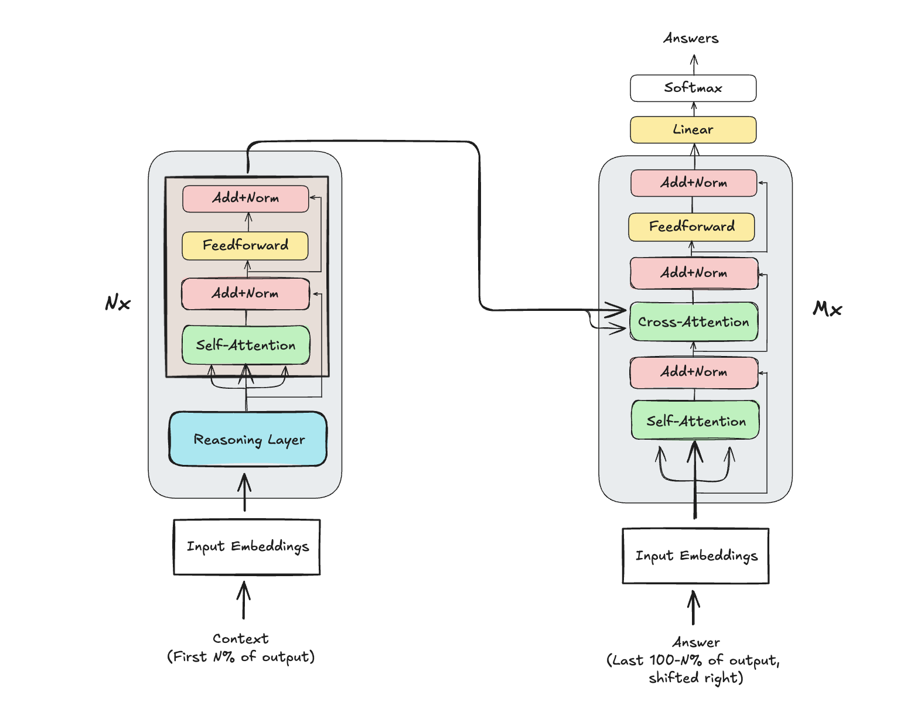

# Encoder-Decoder-SLM

Code for an encoder-decoder LLM which utilizes recurrent "reasoning" layers to advance performance despite low param count

Architecture:

Timeline:

1. Create 5-10M param encoder-decoder model with no recurrency -- show that with high data quality, and modern transformer techniques, it can somewhat understand the english language and perform decently. This model should be trained locally on a single GPU, really showcasing the level of power the average consumer could get.
2. Add recurrency to the model and show that it sees performance gains on major benchmarks, even if minor (shouldn't expect much with low param count)
3. Scale params to 450M and train for 100B tokens, using every bit of free compute I've got available!

## New Features

- Added a tiny evaluation set at `data/eval_sample.jsonl` and hooked it into `train.py`. The trainer now reports
  perplexity every few steps so you can monitor progress.
- Training now enables `torch.compile` (when available) and sets high matmul precision on Apple Silicon for faster
  execution on macOS machines.
